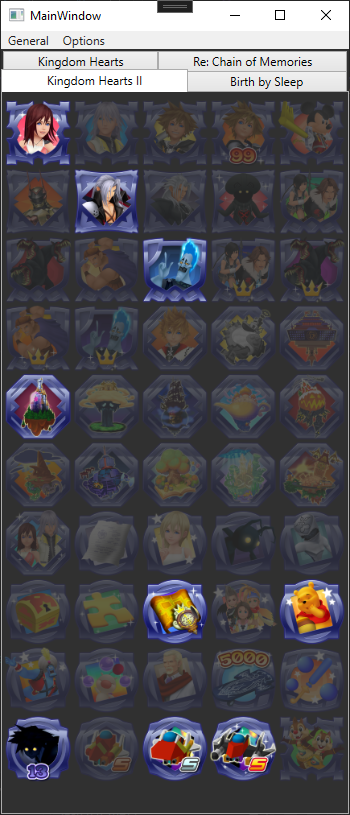

# KHAchievementTracker

This tracker brings back the magic of achievements.
Requires [EOSAchievementHook](https://github.com/Rikux3/EOSAchievementHook) installed.

# Features
* Load and Save your local achievement state (even with Auto-Save!)
* Single game view (for streaming)
* Simple and clean design

# How To Add Games
Most of the achievement view is data driven. You need to first add your game into the `GameInfo` enum and the `GameInfoToGameTitleConverter` class. After that, add your achievements to the `achievements.json` file located in the `KhAchievementTracker.Application` folder. You can refer to the already existing games and achievements.

## How To Get The Achievement Metadata
The Achievement metadata consists of an Id, Name, Description and an Unlocked state. The achievement IDs in KH 1.5+2.5 look like `ACH_XXX`. You can dump a list of achievement IDs with Cheat Engine by searching for the ID pattern. From that, piece together the rest of the informations (don't forget the achievement icons!).